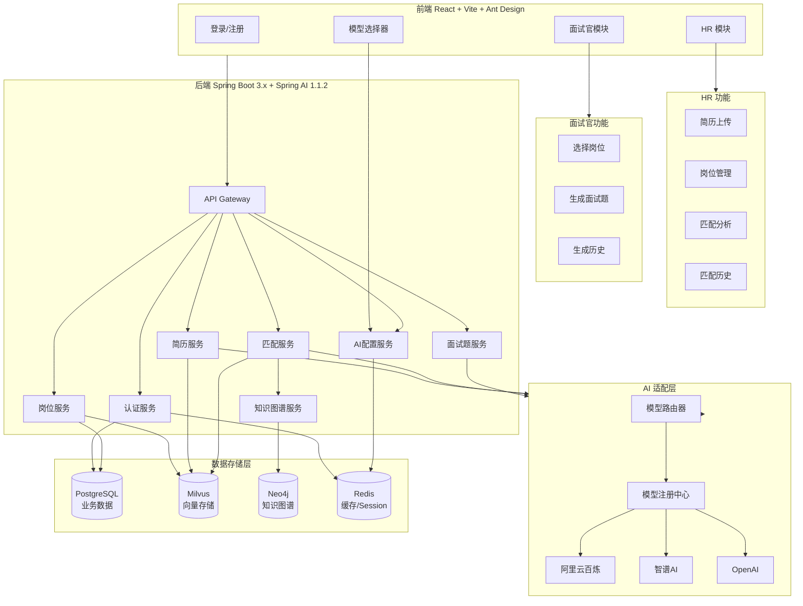
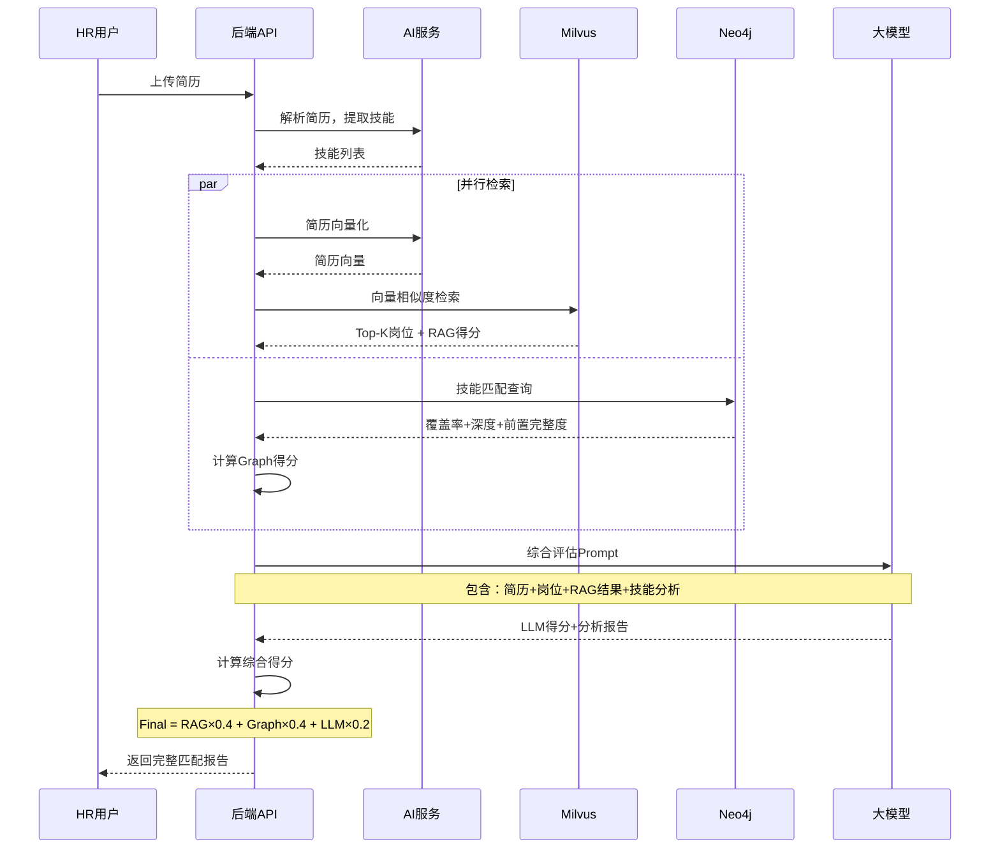
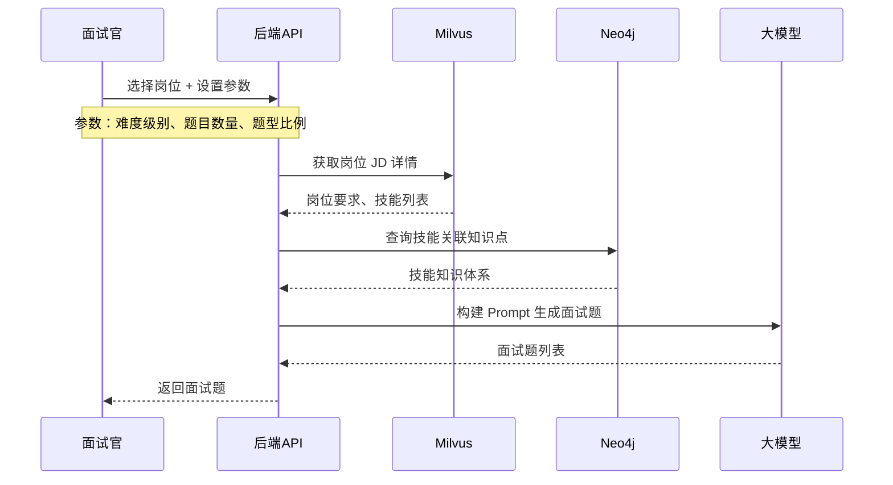
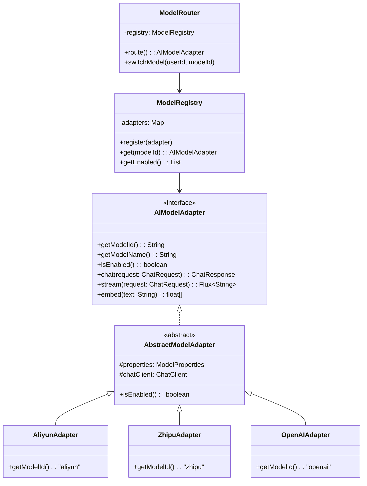
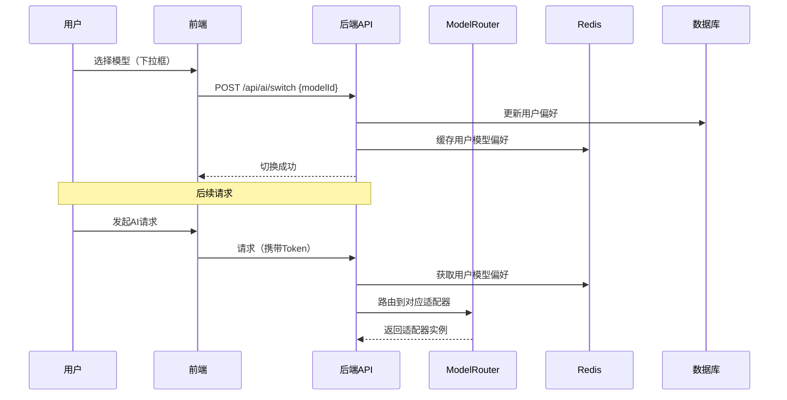
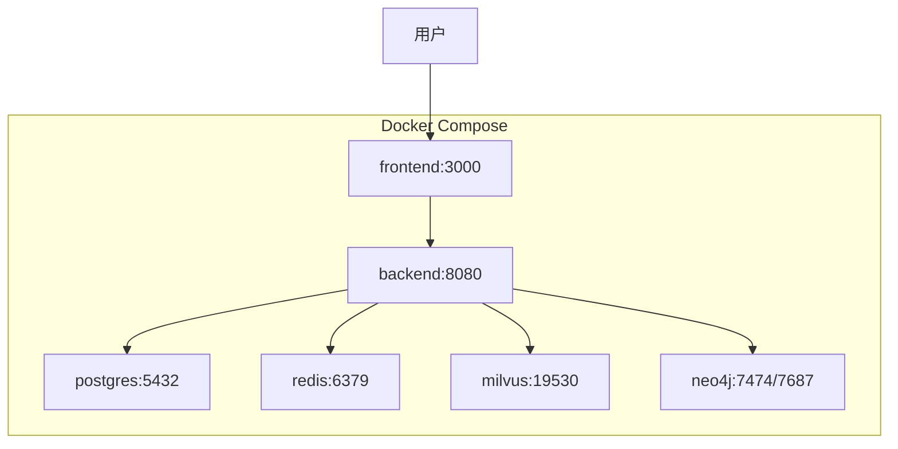

# Smart-HR 智能招聘匹配助手 - 顶层设计文档（完整版）

## 一、项目定位

个人学习项目，用于展示以下技术能力：

- Spring AI 1.1.2 集成与应用
- RAG（检索增强生成）技术实践
- 知识图谱构建与查询
- 混合检索与综合评分算法
- 多模型适配器架构设计（可扩展）
- 企业级向量数据库（Milvus）使用

---

## 二、系统架构总览



---

## 三、技术选型

| 层级           | 技术栈                  | 版本  | 说明                    |
| -------------- | ----------------------- | ----- | ----------------------- |
| **前端框架**   | React + TypeScript      | 18.x  | 现代化前端框架          |
| **前端构建**   | Vite                    | 5.x   | 快速构建工具            |
| **前端 UI**    | Ant Design              | 5.x   | 企业级组件库            |
| **后端框架**   | Spring Boot             | 3.x   | 主体框架                |
| **AI 框架**    | Spring AI               | 1.1.2 | AI 集成框架             |
| **安全框架**   | Spring Security + JWT   | -     | 认证授权                |
| **向量数据库** | Milvus                  | 2.4.x | 统一向量存储            |
| **业务数据库** | PostgreSQL              | 16.x  | 结构化数据              |
| **图数据库**   | Neo4j                   | 5.x   | 知识图谱                |
| **缓存**       | Redis                   | 7.x   | 会话/Token/模型偏好缓存 |
| **容器化**     | Docker + Docker Compose | -     | 一键部署                |

---

## 四、用户角色与权限

| 角色       | 权限说明                                                     |
| ---------- | ------------------------------------------------------------ |
| **HR**     | 上传简历、管理岗位、查看匹配结果、查看历史记录、切换 AI 模型 |
| **面试官** | 查看岗位列表、生成面试题、查看生成历史、切换 AI 模型         |

---

## 五、核心功能模块

### 5.1 HR 模块 - 混合检索与综合评分

#### 整体流程



#### 三维度评分模型

| 维度             | 数据来源        | 权重 | 计算方式                                          |
| ---------------- | --------------- | ---- | ------------------------------------------------- |
| **语义相似度**   | Milvus RAG 检索 | 40%  | 简历向量与岗位 JD 向量的余弦相似度                |
| **技能匹配度**   | Neo4j 知识图谱  | 40%  | 技能覆盖率 ×0.5 + 技能深度 ×0.3 + 前置完整度 ×0.2 |
| **LLM 综合评估** | 大模型分析      | 20%  | 基于上下文的智能评分                              |

#### 综合得分计算公式

```
Final_Score = RAG_Score × 0.4 + Graph_Score × 0.4 + LLM_Score × 0.2

其中 Graph_Score = 覆盖率得分 × 0.5 + 深度得分 × 0.3 + 前置完整度 × 0.2
```

#### 技能匹配度子维度

| 子维度         | 权重 | 计算公式                                |
| -------------- | ---- | --------------------------------------- |
| **技能覆盖率** | 50%  | 匹配技能数 / 岗位要求技能数 × 100       |
| **技能深度**   | 30%  | Σ(技能等级匹配度) / 要求技能数 × 100    |
| **前置完整度** | 20%  | 已掌握前置技能数 / 所需前置技能数 × 100 |

#### 匹配等级划分

| 分数范围 | 匹配等级 | 说明     |
| -------- | -------- | -------- |
| 90-100   | 极度匹配 | 强烈推荐 |
| 80-89    | 高度匹配 | 推荐     |
| 70-79    | 较好匹配 | 可以考虑 |
| 60-69    | 一般匹配 | 有差距   |
| 0-59     | 匹配度低 | 不推荐   |

#### 匹配报告输出结构

```json
{
  "finalScore": 78.6,
  "matchLevel": "较好匹配",
  "scores": {
    "ragScore": { "value": 82, "weight": "40%" },
    "graphScore": {
      "value": 75.5,
      "weight": "40%",
      "breakdown": {
        "coverage": { "value": 75, "weight": "50%" },
        "depth": { "value": 60, "weight": "30%" },
        "prerequisite": { "value": 100, "weight": "20%" }
      }
    },
    "llmScore": { "value": 78, "weight": "20%" }
  },
  "skillAnalysis": {
    "matched": ["Java", "Spring Boot", "MySQL"],
    "missing": ["Redis"],
    "needImprove": ["Java: 熟悉→精通"]
  },
  "learningPath": [...],
  "llmAnalysis": {
    "strengths": [...],
    "weaknesses": [...],
    "suggestion": "..."
  }
}
```

### 5.2 HR 模块 - 岗位管理

| 功能             | 说明                           |
| ---------------- | ------------------------------ |
| 岗位列表         | 查看、搜索、筛选岗位           |
| 新建岗位（表单） | 手动填写岗位信息               |
| 新建岗位（文件） | 上传 Word/PDF/TXT，AI 自动解析 |
| 编辑/删除岗位    | 管理已有岗位                   |

### 5.3 面试官模块 - 面试题生成



---

## 六、AI 适配器架构（可扩展设计）

### 6.1 架构设计



### 6.2 配置驱动（application.yml）

```yaml
smart-hr:
  ai:
    default-model: aliyun

    aliyun:
      enabled: true
      api-key: ${ALIYUN_API_KEY:}
      model: qwen-plus
      embedding-model: text-embedding-v2
      base-url: https://dashscope.aliyuncs.com/compatible-mode/v1

    zhipu:
      enabled: true
      api-key: ${ZHIPU_API_KEY:}
      model: glm-4
      embedding-model: embedding-2

    openai:
      enabled: true
      api-key: ${OPENAI_API_KEY:}
      model: gpt-4o
      embedding-model: text-embedding-3-small
```

### 6.3 快速扩展新模型（3 步完成）

| 步骤 | 操作                             | 改动文件                      |
| ---- | -------------------------------- | ----------------------------- |
| 1    | 实现 AIModelAdapter 接口         | 新增适配器类                  |
| 2    | application.yml 添加配置         | application.yml               |
| 3    | 添加 @ConditionalOnProperty Bean | AIModelAutoConfiguration.java |

### 6.4 用户级模型切换



---

## 七、数据模型设计

### 7.1 PostgreSQL 表结构

```sql
-- 用户表
CREATE TABLE users (
    id BIGSERIAL PRIMARY KEY,
    username VARCHAR(50) UNIQUE NOT NULL,
    password VARCHAR(255) NOT NULL,
    email VARCHAR(100),
    role VARCHAR(20) NOT NULL,           -- HR / INTERVIEWER
    preferred_model VARCHAR(50) DEFAULT 'aliyun',  -- 用户模型偏好
    created_at TIMESTAMP DEFAULT CURRENT_TIMESTAMP
);

-- 岗位表
CREATE TABLE positions (
    id BIGSERIAL PRIMARY KEY,
    title VARCHAR(100) NOT NULL,
    company VARCHAR(100),
    salary_range VARCHAR(50),
    experience VARCHAR(50),
    education VARCHAR(50),
    location VARCHAR(50),
    responsibilities TEXT,
    requirements TEXT,
    skills TEXT[],
    created_by BIGINT REFERENCES users(id),
    created_at TIMESTAMP DEFAULT CURRENT_TIMESTAMP
);

-- 简历表
CREATE TABLE resumes (
    id BIGSERIAL PRIMARY KEY,
    user_id BIGINT REFERENCES users(id),
    file_name VARCHAR(255),
    file_path VARCHAR(500),
    content TEXT,
    extracted_skills TEXT[],
    created_at TIMESTAMP DEFAULT CURRENT_TIMESTAMP
);

-- 匹配记录表
CREATE TABLE match_records (
    id BIGSERIAL PRIMARY KEY,
    resume_id BIGINT REFERENCES resumes(id),
    position_id BIGINT REFERENCES positions(id),
    final_score DECIMAL(5,2),
    rag_score DECIMAL(5,2),
    graph_score DECIMAL(5,2),
    llm_score DECIMAL(5,2),
    report JSONB,
    created_at TIMESTAMP DEFAULT CURRENT_TIMESTAMP
);

-- 面试题记录表
CREATE TABLE interview_records (
    id BIGSERIAL PRIMARY KEY,
    position_id BIGINT REFERENCES positions(id),
    user_id BIGINT REFERENCES users(id),
    difficulty VARCHAR(20),
    questions JSONB,
    created_at TIMESTAMP DEFAULT CURRENT_TIMESTAMP
);
```

### 7.2 Milvus Collection

```
Collection: position_vectors
├── id (INT64)
├── title (VARCHAR)
├── embedding (FLOAT_VECTOR[1536])
└── created_at (INT64)

Collection: resume_vectors
├── id (INT64)
├── user_id (INT64)
├── embedding (FLOAT_VECTOR[1536])
└── created_at (INT64)
```

### 7.3 Neo4j 知识图谱

```
节点 (Nodes):
├── SkillCategory {name, code, description}
└── Skill {name, level, description, keywords[]}

关系 (Relationships):
├── (Skill)-[:BELONGS_TO]->(SkillCategory)
├── (Skill)-[:REQUIRES]->(Skill)        # 前置依赖
├── (Skill)-[:RELATED_TO]->(Skill)      # 相关技能
└── (Skill)-[:UPGRADES_TO]->(Skill)     # 进阶路径
```

---

## 八、API 接口设计

### 8.1 认证模块

| 方法 | 路径                 | 说明         |
| ---- | -------------------- | ------------ |
| POST | `/api/auth/register` | 用户注册     |
| POST | `/api/auth/login`    | 用户登录     |
| POST | `/api/auth/logout`   | 用户登出     |
| GET  | `/api/auth/me`       | 获取当前用户 |

### 8.2 岗位模块

| 方法   | 路径                    | 说明             |
| ------ | ----------------------- | ---------------- |
| GET    | `/api/positions`        | 获取岗位列表     |
| GET    | `/api/positions/{id}`   | 获取岗位详情     |
| POST   | `/api/positions`        | 创建岗位（表单） |
| POST   | `/api/positions/upload` | 上传岗位文件     |
| PUT    | `/api/positions/{id}`   | 更新岗位         |
| DELETE | `/api/positions/{id}`   | 删除岗位         |

### 8.3 简历模块

| 方法 | 路径                  | 说明         |
| ---- | --------------------- | ------------ |
| POST | `/api/resumes/upload` | 上传简历     |
| GET  | `/api/resumes`        | 获取简历列表 |
| GET  | `/api/resumes/{id}`   | 获取简历详情 |

### 8.4 匹配模块

| 方法 | 路径                      | 说明                 |
| ---- | ------------------------- | -------------------- |
| POST | `/api/match/analyze`      | 执行混合检索匹配分析 |
| GET  | `/api/match/records`      | 获取匹配历史         |
| GET  | `/api/match/records/{id}` | 获取匹配详情         |

### 8.5 面试题模块

| 方法 | 路径                      | 说明         |
| ---- | ------------------------- | ------------ |
| POST | `/api/interview/generate` | 生成面试题   |
| GET  | `/api/interview/records`  | 获取生成历史 |

### 8.6 AI 配置模块

| 方法 | 路径              | 说明                   |
| ---- | ----------------- | ---------------------- |
| GET  | `/api/ai/models`  | 获取可用模型列表       |
| GET  | `/api/ai/current` | 获取当前用户使用的模型 |
| POST | `/api/ai/switch`  | 切换用户的模型偏好     |

---

## 九、预置数据

### 9.1 岗位 JD（20 个）

| 类别 | 岗位                                  |
| ---- | ------------------------------------- |
| 后端 | Java 初级/中级/高级、Python 中级/高级 |
| 前端 | React 中级、Vue 中级、高级前端        |
| 测试 | 测试初级/高级、自动化测试             |
| 算法 | NLP 算法、CV 算法                     |
| 数据 | 数据工程师                            |
| 管理 | 项目经理中级/高级                     |
| 职能 | HR 专员、HRBP、产品经理、运营专员     |

### 9.2 知识图谱技能节点（200+）

| 分类     | 数量 | 示例                              |
| -------- | ---- | --------------------------------- |
| 后端开发 | 40+  | Java, Spring Boot, MyBatis, Go... |
| 前端开发 | 35+  | React, Vue, TypeScript...         |
| 数据库   | 25+  | MySQL, PostgreSQL, Redis...       |
| DevOps   | 25+  | Docker, K8s, Jenkins...           |
| 人工智能 | 30+  | PyTorch, NLP, RAG...              |
| 测试     | 20+  | JUnit, Selenium...                |
| 项目管理 | 15+  | Scrum, 敏捷, JIRA...              |
| 通用能力 | 15+  | 沟通, 协作, 学习能力...           |

---

## 十、项目目录结构

```
smart-hr/
├── back/
│   ├── src/main/java/com/smarthr/
│   │   ├── SmartHrApplication.java
│   │   ├── config/
│   │   │   ├── SecurityConfig.java
│   │   │   ├── MilvusConfig.java
│   │   │   ├── Neo4jConfig.java
│   │   │   └── AIModelAutoConfiguration.java
│   │   ├── controller/
│   │   │   ├── AuthController.java
│   │   │   ├── PositionController.java
│   │   │   ├── ResumeController.java
│   │   │   ├── MatchController.java
│   │   │   ├── InterviewController.java
│   │   │   └── AIConfigController.java
│   │   ├── service/
│   │   │   ├── auth/
│   │   │   │   └── AuthService.java
│   │   │   ├── position/
│   │   │   │   └── PositionService.java
│   │   │   ├── resume/
│   │   │   │   └── ResumeService.java
│   │   │   ├── interview/
│   │   │   │   └── InterviewService.java
│   │   │   ├── ai/
│   │   │   │   ├── AIModelAdapter.java
│   │   │   │   ├── AbstractModelAdapter.java
│   │   │   │   ├── AliyunAdapter.java
│   │   │   │   ├── ZhipuAdapter.java
│   │   │   │   ├── OpenAIAdapter.java
│   │   │   │   ├── ModelRegistry.java
│   │   │   │   └── ModelRouter.java
│   │   │   ├── rag/
│   │   │   │   ├── EmbeddingService.java
│   │   │   │   └── VectorSearchService.java
│   │   │   ├── graph/
│   │   │   │   └── SkillGraphService.java
│   │   │   └── match/
│   │   │       └── HybridMatchService.java
│   │   ├── repository/
│   │   │   ├── UserRepository.java
│   │   │   ├── PositionRepository.java
│   │   │   ├── ResumeRepository.java
│   │   │   ├── MatchRecordRepository.java
│   │   │   └── InterviewRecordRepository.java
│   │   ├── entity/
│   │   │   ├── User.java
│   │   │   ├── Position.java
│   │   │   ├── Resume.java
│   │   │   ├── MatchRecord.java
│   │   │   └── InterviewRecord.java
│   │   ├── dto/
│   │   │   ├── request/
│   │   │   └── response/
│   │   └── security/
│   │       ├── JwtTokenProvider.java
│   │       └── JwtAuthenticationFilter.java
│   ├── src/main/resources/
│   │   ├── application.yml
│   │   ├── application-dev.yml
│   │   └── data/
│   │       ├── positions.json
│   │       └── skills.cypher
│   ├── pom.xml
│   └── Dockerfile
│
├── front/
│   ├── src/
│   │   ├── api/
│   │   │   ├── auth.ts
│   │   │   ├── position.ts
│   │   │   ├── resume.ts
│   │   │   ├── match.ts
│   │   │   ├── interview.ts
│   │   │   └── ai.ts
│   │   ├── components/
│   │   │   ├── Layout/
│   │   │   ├── ModelSelector/
│   │   │   └── common/
│   │   ├── pages/
│   │   │   ├── Login/
│   │   │   ├── Register/
│   │   │   ├── HR/
│   │   │   │   ├── ResumeUpload/
│   │   │   │   ├── PositionManage/
│   │   │   │   ├── MatchResult/
│   │   │   │   └── MatchHistory/
│   │   │   └── Interviewer/
│   │   │       ├── PositionList/
│   │   │       ├── GenerateQuestions/
│   │   │       └── QuestionHistory/
│   │   ├── store/
│   │   │   ├── authStore.ts
│   │   │   └── aiStore.ts
│   │   ├── hooks/
│   │   ├── utils/
│   │   ├── routes/
│   │   │   └── index.tsx
│   │   ├── App.tsx
│   │   └── main.tsx
│   ├── package.json
│   ├── vite.config.ts
│   ├── tsconfig.json
│   └── Dockerfile
│
├── docker/
│   ├── docker-compose.yml
│   ├── docker-compose.dev.yml
│   ├── milvus/
│   │   └── docker-compose.yml
│   ├── neo4j/
│   │   └── init.cypher
│   └── postgres/
│       └── init.sql
│
└── docs/
    └── design.md
```

---

## 十一、部署架构



**启动命令：**

```bash
# 一键启动所有服务
docker-compose up -d

# 或分步启动
docker-compose up -d postgres redis neo4j milvus  # 先启动中间件
docker-compose up -d backend                       # 再启动后端
docker-compose up -d frontend                      # 最后启动前端
```

---

## 十二、实施阶段规划

| 阶段 | 内容                                              | 时间     |
| ---- | ------------------------------------------------- | -------- |
| 1    | 基础架构：Spring Boot + React 初始化，Docker 环境 | Week 1   |
| 2    | 认证模块：Spring Security + JWT                   | Week 1-2 |
| 3    | AI 适配层：多模型适配器 + 用户级切换              | Week 2   |
| 4    | RAG 模块：Milvus 向量存储与检索                   | Week 2-3 |
| 5    | 知识图谱：Neo4j 集成与技能查询                    | Week 3   |
| 6    | 混合检索：三维度评分算法实现                      | Week 3   |
| 7    | 业务功能：HR 端 + 面试官端                        | Week 3-4 |
| 8    | 前端页面：完整界面开发                            | Week 4   |
| 9    | 预置数据：20 岗位 + 200+技能                      | Week 4   |
| 10   | 部署优化：Docker Compose 完善                     | Week 4-5 |

---

## 十三、项目亮点总结

| 亮点                | 说明                                         |
| ------------------- | -------------------------------------------- |
| **Spring AI 1.1.2** | 最新版本，Chat/Embedding/Tool Calling        |
| **多模型适配器**    | 可配置切换阿里云/智谱/OpenAI，3 步扩展新模型 |
| **用户级模型切换**  | 每个用户可选择偏好的 AI 模型                 |
| **混合检索评分**    | RAG + 知识图谱 + LLM 三维度综合评分          |
| **Milvus 向量库**   | 企业级向量数据库实践                         |
| **Neo4j 知识图谱**  | 200+ 技能节点，前置依赖建模                  |
| **完整前后端分离**  | React + Spring Boot                          |
| **Docker 一键部署** | 开箱即用                                     |

---

## 十四、实施任务清单

### 14.1 后端任务

1. **backend-init**: Spring Boot 3.x + Spring AI 1.1.2 项目初始化与依赖配置
2. **docker-setup**: Docker Compose 环境配置（PostgreSQL/Redis/Milvus/Neo4j）
3. **auth-module**: Spring Security + JWT 认证模块实现
4. **ai-adapter**: AI 模型适配器层实现（阿里云/智谱/OpenAI + 用户级切换）
5. **rag-module**: RAG 模块：Milvus 向量存储与检索服务
6. **graph-module**: 知识图谱模块：Neo4j 集成与技能查询服务
7. **hybrid-match**: 混合检索评分：RAG + 知识图谱 + LLM 三维度综合评分
8. **preset-data**: 预置数据：20 个岗位 JD + 200+技能节点
9. **hr-backend**: HR 后端功能：简历上传/解析/岗位管理/匹配分析
10. **interview-backend**: 面试官后端功能：面试题生成 API

### 14.2 前端任务

1. **frontend-init**: React + Vite + Ant Design + TypeScript 项目初始化
2. **frontend-pages**: 前端页面开发：登录/HR 端/面试官端/模型选择器

### 14.3 部署任务

1. **docker-deploy**: Docker Compose 完整部署配置与测试

